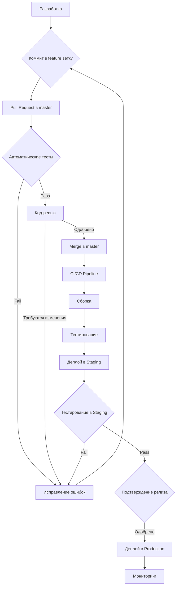

# Процесс релиза

## Блок-схема процесса релиза

## Требования и ожидаемые результаты

### Требования:
1. **Непрерывная интеграция:**
   - Автоматическая сборка при каждом коммите
   - Запуск unit-тестов
   - Статический анализ кода

2. **Непрерывная доставка:**
   - Автоматический деплой в тестовую среду
   - Ручное подтверждение для Production
   - Возможность отката при неудачном релизе

3. **Прозрачность процесса:**
   - Уведомления о статусе сборки
   - История релизов
   - Документирование изменений

### Ожидаемые результаты:
1. Сокращение времени от разработки до релиза
2. Повышение качества кода
3. Снижение количества ошибок в Production
4. Стандартизация процесса разработки и выпуска
5. Улучшение коллаборации внутри команды 